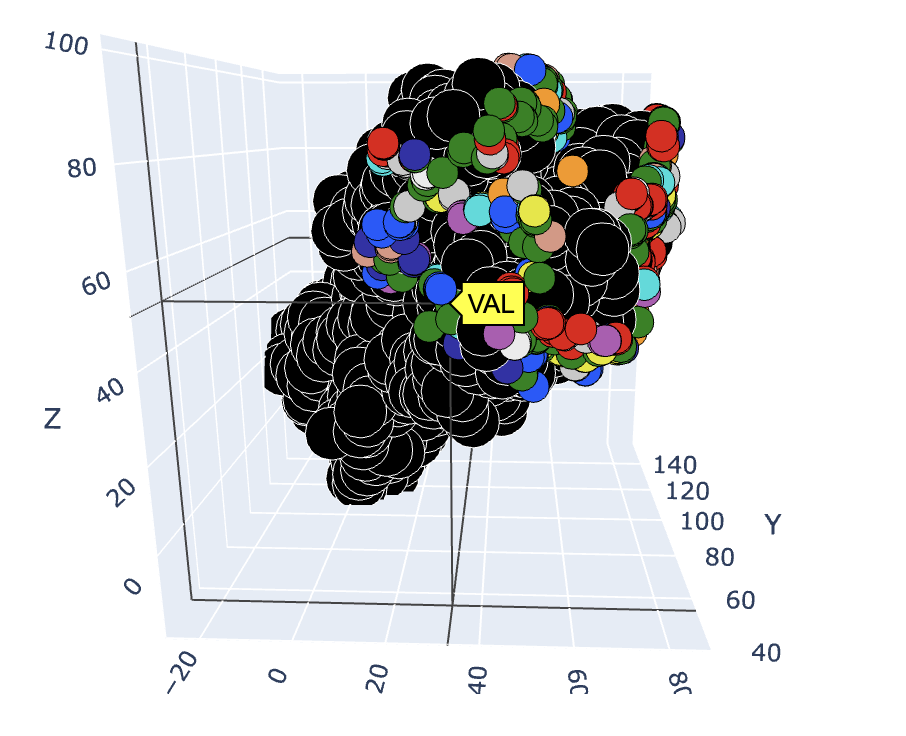
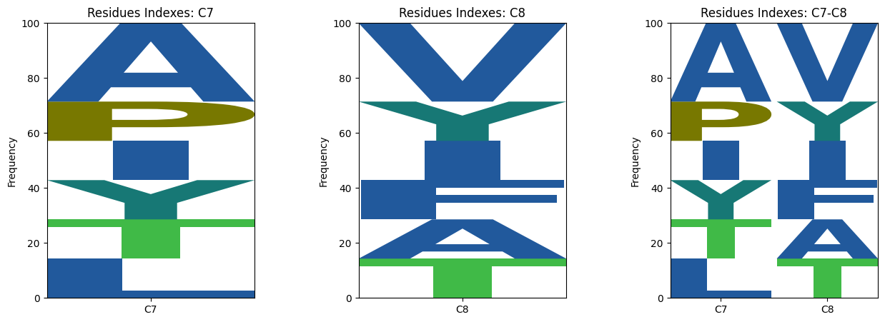

# Distanced base sequence logos

This online tool, hosted on Google Colab, is designed to generate sequence logos based on the distance from a target residue or ligand in a given dataset of pdbs. The distance is calculated using the alpha carbon positions between protein interfaces or all non-hydrogen atoms in the case of ligands. The tool also includes a 3D visualizer that plots the entire target structure and highlights the residues within the specified distance constraint. There are two options for colering the interacting residues based on [Amino colour](http://acces.ens-lyon.fr/biotic/rastop/help/colour.htm#aminocolours) and [Shapely colour](http://acces.ens-lyon.fr/biotic/rastop/help/colour.htm#shapelycolours). 

The sequence logos aim to show sequence diversity in binding interactions with various motifs or structures. 

This tool is able to generate sequence logos  and 3d scatter plots from a protein (Figure 1,3) or a ligand (Figure 2,4) target. 

<div style="display: flex; flex-direction: row; justify-content: space-between;">
    <div style="flex: 1; padding-right: 5px;">
        
        <p style="text-align: center; font-weight: bold;">Figure One</p>
    </div>
    <div style="flex: 1; padding-left: 5px;">
        
        <p style="text-align: center; font-weight: bold;">Figure Two</p>
    </div>
</div>

<div style="display: flex; flex-direction: row; justify-content: space-between;">
    <div style="flex: 1; padding-right: 5px;">
        
        <p style="text-align: center; font-weight: bold;">Figure Three</p>
    </div>
    <div style="flex: 1; padding-left: 5px;">
        
        <p style="text-align: center; font-weight: bold;">Figure Four</p>
    </div>
</div>

Click [here](https://colab.research.google.com/github/DanielP520/sequence_logo_project/blob/main/LogoMaker.ipynb) to use the interactive google colab tool. 


```python

```
