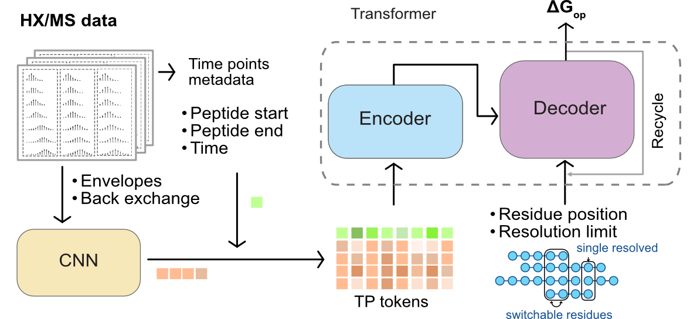
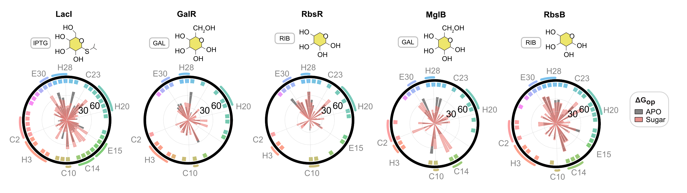

<!-- Global site tag (gtag.js) - Google Analytics -->
<script async src="https://www.googletagmanager.com/gtag/js?id=G-YXZFB7HB4L"></script>
<script>
  window.dataLayer = window.dataLayer || [];
  function gtag(){dataLayer.push(arguments);}
  gtag('js', new Date());

  gtag('config', 'G-YXZFB7HB4L');
</script>

<!-- #region -->
(my-label)=
## Publications

__Bold__ indicates our lab members.
<br/>
<br/>

#### Preprints

<br/>

+++
+++
+++



<br/>
<br/>

__Chenlin Lu__\*, __Kyle C. Weber__\*, __Savannah K. McBride__, __Andrew Reckers__, and __Anum Glasgow__. [A machine learning method for calculating highly localized protein stabilities.](https://www.biorxiv.org/content/10.1101/2025.10.21.683809v1) *bioRxiv*, October 2025. (\* co-first authors)
<br/>
<br/>
Check out PFNet: [Github repo](https://github.com/glasgowlab/PFNet?tab=readme-ov-file) / [HuggingFace](https://huggingface.co/spaces/glasgow-lab/PFNet)
<br/>
<br/>
<br/>


+++
+++
+++

__Kyle C. Weber__\*, __Chenlin Lu__\*, Roberto Vera Alvarez, Bruce D. Pascal, and __Anum Glasgow__. [HXMS: a standardized file format for HX/MS data.](https://www.biorxiv.org/content/10.1101/2025.10.14.682397v1) *bioRxiv*, October 2025. (\* co-first authors)
<br/>
<br/>
Check out PFLink: [HuggingFace](https://huggingface.co/spaces/glasgow-lab/PFLink)
<br/>
<br/>
<br/>

+++
+++
+++

Prashath Karunaraj, Remkes Scheele, __Malcolm L. Wells__, Ruchita Rathod, Sophia Abrahamson, Lila C. Taylor, Ipek S. Gokulu, Lamia Chowdhury, Abiha Kazmi, Weixiao Song, Peter Hornbeck, Jing Li, __Anum Glasgow__, and Neil Vasan. [A hotspot phosphorylation site on SHP2 drives oncoprotein activation and drug resistance.](https://www.biorxiv.org/content/10.1101/2025.06.11.659120v1.full) *bioRxiv*, June 2025.

<br/>
<br/>

+++
+++
+++


<br/>
<br/>

__Malcolm L. Wells__\*, __Chenlin Lu__\*, __Daniel Sultanov__\*, __Kyle C. Weber__\*, Zhen Gong, and __Anum Glasgow__. [Conserved energetic changes drive function in an ancient protein fold.](https://www.biorxiv.org/content/10.1101/2025.04.02.646877v1) *bioRxiv*, April 2025.  (\* co-first authors)
<br/>
<br/>


+++
+++
+++

#### Peer-reviewed
<br/>
<br/>

Ryan S. Roark, Andrew J. Schaub, Wei Shi, Maple Wang, Fabiana A. Bahna, Jordan E. Becker, Andrea Biju, Sue Chong, Haijuan Du, Yicheng Guo, Hsiang Hong, Phinikoula S. Katsamba, Seetha M. Mannepalli, Adam S. Olia, Li Ou, Sarah K. Rubin, Yosef Sabo, Mehin Suleiman, __Malcolm L. Wells__, Baoshan Zhang, Cheng Cheng, __Anum Glasgow__, David D. Ho, Yaoxing Huang, Theodore C. Pierson, Reda Rawi, Tongqing Zhou, Lawrence Shapiro\*, and Peter D. Kwong\*. [Prefusion structure, evasion and neutralization of HSV-1 glycoprotein B.](https://www.nature.com/articles/s41564-025-02153-x) *Nature
Microbiology*, 10, 2025. (*co-corresponding authors)

<br/>
<br/>

+++
+++
+++


```{image} ref_figures/20240720_fig1_glab_website.png
:height: 140px
:class: mb-1 mt-0
:align: right
:alt: Derive site-resolved ∆Gop
```

__Chenlin Lu__\*, __Malcolm L. Wells__\*, __Andrew Reckers__, __Savannah K. McBride__, and __Anum Glasgow__. [Site-resolved energetic information from HX/MS experiments.](https://www.nature.com/articles/s41589-025-02049-1) *Nature Chemical Biology*, October 2025.  (\* co-first authors)
<br/>
<br/>
Check out PIGEON-FEATHER: [PDF](https://rdcu.be/eLtCF) / [Github repo](https://github.com/glasgowlab/PIGEON-FEATHER) / [Documentation](http://glasgowlab.org/PIGEON-FEATHER)

<br/>
<br/>

+++
+++
+++

```{image} ref_figures/magpie_energies.png
:height: 300px
:class: bg-primary mb-1
:align: left
:alt: Calculate thousands of interaction energies on the fly.
```
<br/>
<br/>

__Daniel C. Pineda Rodriguez__, __Kyle C. Weber__, __Belen Sundberg__, and __Anum Glasgow__. [MAGPIE: an interactive tool for visualizing and analyzing protein-ligand interactions.](https://onlinelibrary.wiley.com/doi/10.1002/pro.5027) *Protein Science*, 33(8), July 2024.
<br/>
<br/>
Check out MAGPIE: [Google CoLab](https://colab.research.google.com/github/glasgowlab/MAGPIE/blob/GoogleColab/MAGPIE_COLAB.ipynb) / [Github repo](https://github.com/glasgowlab/MAGPIE/tree/local-version) / [Tutorial](https://magpie-docs.readthedocs.io/en/latest/Introduction.html)
<br/>
<br/>
<br/>
<br/>

+++
+++
+++

<br/>
<br/>

Stephanie F. Maurina\*, John P. O'Sullivan\*, Geetika Sharma\*, __Daniel C. Pineda Rodriguez__, Andrea MacFadden, Francesca Cendali, Morkos A. Henen, Jeffrey S. Kieft, __Anum Glasgow__, and Anna-Lena Steckelberg. [An evolutionarily conserved strategy for ribosome binding and inhibition by β-coronavirus non-structural protein 1.](https://www.sciencedirect.com/science/article/pii/S0022283623003704) *Journal of Molecular Biology*, 435(20), October 2023. (\* co-first authors)
<br/>
<br/>
<br/>

+++
+++
+++


Birte Höcker, Peilong Lu, __Anum Glasgow__, Debora S. Marks, Pranam Chatterjee, Joanna S. G. Slusky, Ora Schueler-Furman, and Possu Huang. [How can the protein design community best support biologists who want to harness AI tools for protein structure prediction and design?](https://linkinghub.elsevier.com/retrieve/pii/S2405-4712(23)00212-0) *Cell Systems* 14(8), August 2023. (Invited commentary.)

<br/>
<br/>

+++
+++
+++

```{image} ref_figures/lacI.png
:height: 200px
:class: bg-primary mb-1
:align: right
:alt: Allostery in the lac repressor.
```
<br/>
<br/>

__Anum Glasgow\*__, Helen T. Hobbs, Zion R. Perry, __Malcolm L. Wells__, Susan Marqusee, and Tanja Kortemme. [Ligand-specific changes in conformational flexibility mediate long-range allostery in the *lac* repressor.](https://www.nature.com/articles/s41467-023-36798-1) *Nature Communications* 14(1179), February 2023. (\* corresponding author)
<br/>
<br/>
<br/>
<br/>

+++
+++
+++

Soumya G. Remesh, Gregory E. Merz, Axel F. Brilot, Un Seng Chio, Alexandrea N. Rizo, Thomas H. Pospiech Jr., Irene Lui, Mathew T. Laurie, Jeff Glasgow, Chau Q. Le, Yun Zhang, Devan Diwanji, Evelyn Hernandez, Jocelyne Lopez, Komal Ishwar Pawar, Sergei Pourmal, Amber M. Smith, Fengbo Zhou, QCRG Structural Biology Consortium, Joseph DeRisi, Tanja Kortemme, Oren S. Rosenberg, __Anum Glasgow__\*, Kevin K. Leung\*, James A. Wells\*, and Kliment A. Verba\*. [Computational pipeline provides mechanistic understanding of Omicron variant of concern neutralizing engineered ACE2 receptor traps.](https://www.cell.com/structure/fulltext/S0969-2126(23)00030-8) *Structure* 31, February 2023. (\* co-corresponding authors)
<br/>
<br/>
+++
+++
+++

__Pre-CUMC publications__
</br>
</br>

```{image} ref_figures/spluc.jpg
:height: 150px
:class: bg-primary mb-1
:align: left
:alt: Solution-based serology to detect COVID antibodies.
```
Susanna K. Elledge\*, Xin X. Zhou\*, James R. Byrnes, Alexander J. Martinko, Irene Lui, Katarina Pance, Shion A. Lim, Jeff E. Glasgow, __Anum A. Glasgow__, Keirstinne Turcios, Nikita S. Iyer, Leonel Torres, Michael J. Peluso, Timothy J. Henrich, Taia T. Wang, Cristina M. Tato, Kevin K. Leung, Bryan Greenhouse, and James A. Wells. [Engineering luminescent biosensors for point-of-care SARS-CoV-2 antibody detection.](https://www.doi.org/10.1038/s41587-021-00878-8) *Nature Biotechnology*, 39(8), August 2021. (\* co-first authors)

<br/>
<br/>
<br/>

+++
+++
+++

Jeff Glasgow\*, __Anum Glasgow__\*, Tanja Kortemme and James A. Wells. [Reply to Liu *et al.*: Specific mutations matter in specificity and catalysis in ACE2.](https://www.pnas.org/doi/full/10.1073/pnas.2024450118) *Proceedings of the National Academy of Sciences*, 118(15), April 2021. (\* co-first authors)

<br/>
<br/>
<br/>

+++
+++
+++

```{image} ref_figures/ace2.jpg
:height: 250px
:class: bg-primary mb-1
:align: right
:alt: Engineering SARS-CoV-2 neutralizing receptor traps.
```

<br/>
<br/>

__Anum Glasgow\*__, Jeff Glasgow\*, Daniel Limonta, Paige Solomon, Irene Lui, Yang Zhang, Matthew A. Nix, Nicholas J. Rettko, Shoshana Zha, Rachel Yamin, Kevin Kao, Oren S. Rosenberg, Jeffrey V. Ravetch, Arun P. Wiita, Kevin K. Leung, Shion A. Lim, Xin X. Zhou, Tom C. Hobman, Tanja Kortemme, and James A. Wells. [Engineered ACE2 receptor traps potently neutralize SARS-CoV-2.](https://www.doi.org/10.1073/pnas.2016093117) *Proceedings of the National Academy of Sciences*, 117(45), November 2020. (\* co-first authors)

+++
+++
+++
<br/>
<br/>
<br/>
<br/>

```{image} ref_figures/biosensor.png
:height: 130px
:class: mb-1
:align: left
:alt: De novo design of a protein-based biosensor.
```

__Anum A. Glasgow\*__, Yao-Ming Huang\*, Daniel J. Mandell\*, Michael Thompson, Ryan Ritterson, Amanda L. Loshbaugh, Jenna Pellegrino, Cody Krivacic, Roland A. Pache, Kyle A. Barlow, Noah Ollikainen, Deborah Jeon, Mark J. S. Kelly, James S. Fraser, and Tanja Kortemme. [Computational design of a modular protein sense/response system.](https://www.doi.org/10.1126/science.aax8780) *Science*, 366(6468), November 2019. (\* co-first authors)

+++
+++
+++
<br/>
<br/>
<br/>

__Anum Azam Glasgow__ and Danielle Tullman-Ercek. [Type III Secretion Filaments as Templates for Metallic Nanostructure Synthesis.](https://www.doi.org/10.1007/978-1-4939-7893-9_12) *Methods in Molecular Biology*, 1798, 2018.

+++
+++
+++
<br/>
<br/>

```{image} ref_figures/sipD.jpg
:height: 120px
:class: bg-primary mb-1
:align: left
:alt: A dual role for a Salmonella structural protein.
```

<br/>

__Anum Azam Glasgow__, Han Teng Wong, and Danielle Tullman-Ercek. [A Secretion-Amplification Role for Salmonella enterica Translocon Protein SipD.](https://www.doi.org/10.1021/acssynbio.6b00335) *ACS Synthetic Biology*, 6(6), June 2017.

+++
+++
+++
<br/>
<br/>

```{image} ref_figures/nanowires_2.png
:height: 200px
:class: bg-primary mb-1
:align: right
:alt: Filament-templated metal rods on cells.
```

__Anum Azam__ and Danielle Tullman-Ercek. [Type-III secretion filaments as scaffolds for inorganic nanostructures.](https://www.doi.org/10.1098/rsif.2015.0938) *Journal of the Royal Society Interface*, 13(114), January 2016.

+++
+++
+++
<br/>
<br/>

__Anum Azam__, Cheng Li, Kevin J. Metcalf, and Danielle Tullman-Ercek. [Type III secretion as a generalizable strategy for the production of full-length biopolymer-forming proteins.](https://www.doi.org/10.1002/bit.25656
) *Biotechnology and Bioengineering*, 113(11), November 2016.

+++
+++
+++
<br/>
<br/>

Kevin J. Metcalf, Casey Finnerty, __Anum Azam__, Elias Valdivia, and Danielle Tullman-Ercek. [Using Transcriptional Control To Increase Titers of Secreted Heterologous Proteins by the Type III Secretion System.](https://www.doi.org/10.1128/AEM.01330-14) *Applied and Environmental Microbiology*, 80(19), October 2014.

+++
+++
+++
<br/>
<br/>

```{image} ref_figures/polymerbox.jpg
:height: 130px
:class: bg-primary mb-1
:align: left
:alt: Biofriendly micro-containers for drug delivery.
```
<br/>

__Anum Azam__, Kate E. Laflin, Mustapha Jamal, Rohan Fernandes, and David H. Gracias. [Self-folding micropatterned polymeric containers.](https://www.doi.org/10.1007/s10544-010-9470-x) *Biomedical Microdevices*, 13(1), February 2011.

+++
+++
+++
<br/>
<br/>

Jeong-Hyun Cho, __Anum Azam__, and David H. Gracias. [Three Dimensional Nanofabrication Using Surface Forces.](https://www.doi.org/10.1021/la1013889) *Langmuir*, 26(21), November 2010.

+++
+++
+++
<br/>
<br/>

```{image} ref_figures/dodecs.jpg
:height: 200px
:class: bg-primary mb-1
:align: left
:alt: Designing self-folding micro-polyhedra.
```

<br/>
<br/>

David J. Filipiak\*, __Anum Azam\*__, Timothy G. Leong, and David H. Gracias. [Hierarchical self-assembly of complex polyhedral microcontainers.](https://www.doi.org/10.1088/0960-1317/19/7/075012) *Journal of Micromechanics and Microengineering*, 19(7), June 2009. (\* co-first authors)

<br/>
<br/>
<br/>

__Anum Azam__, Timothy G. Leong, Aasiyeh M. Zarafshar, and David H. Gracias. [Compactness Determines the Success of Cube and Octahedron Self-Assembly.](https://www.doi.org/10.1371/journal.pone.0004451) *PLOS ONE*, 4(2), February 2009.

<!-- #endregion -->
