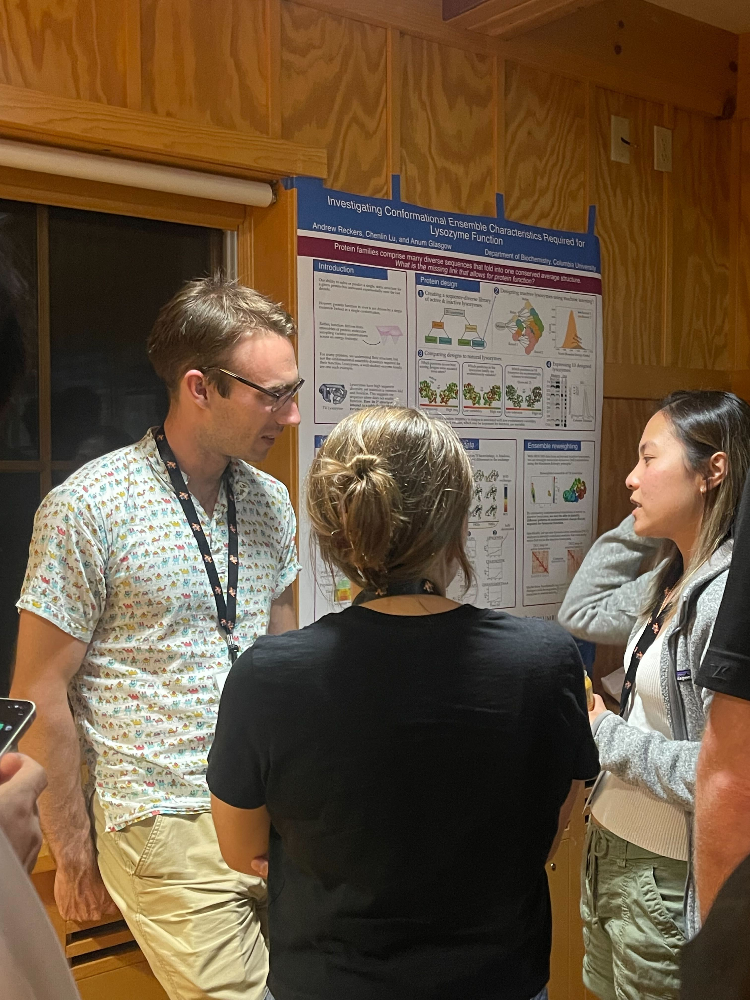
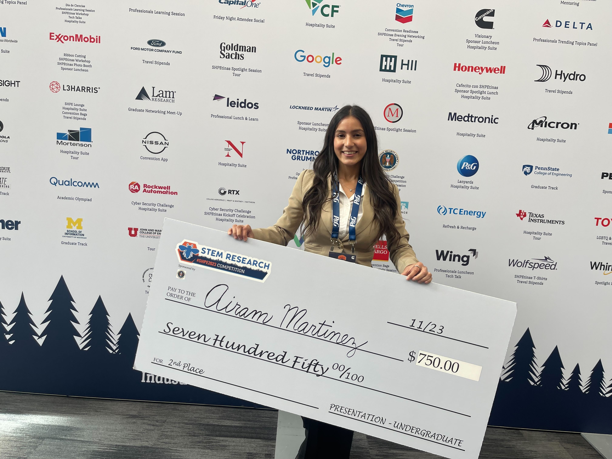
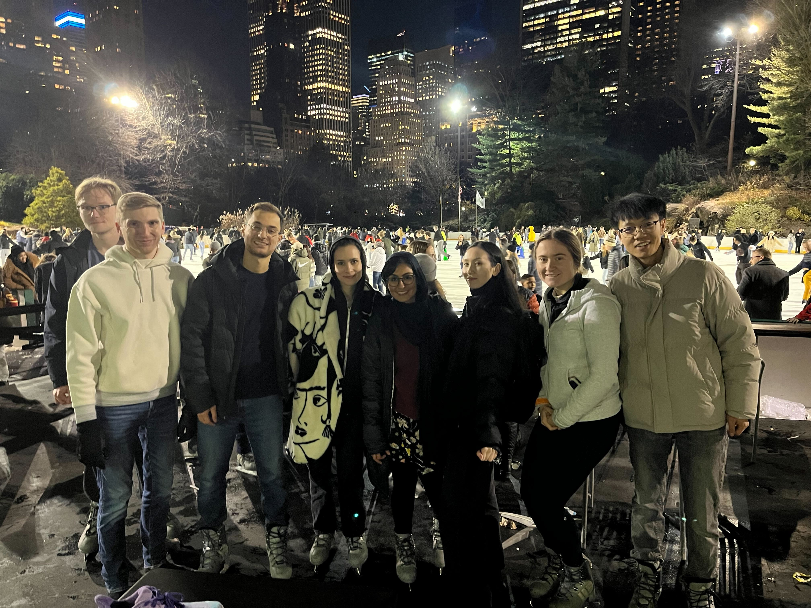
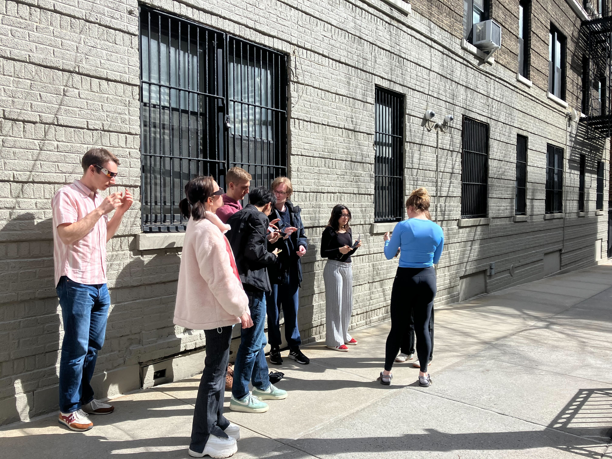
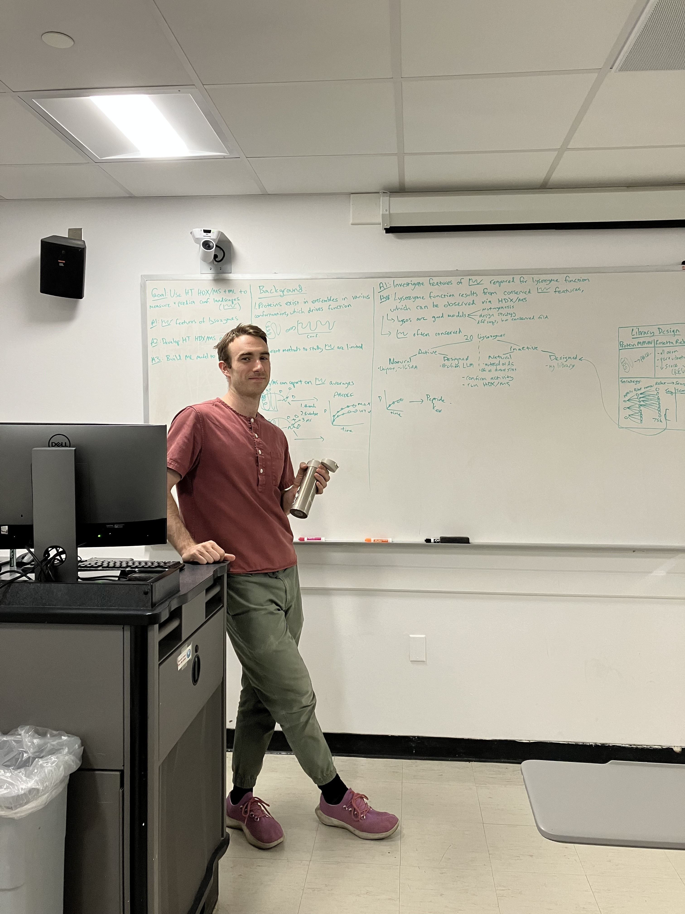
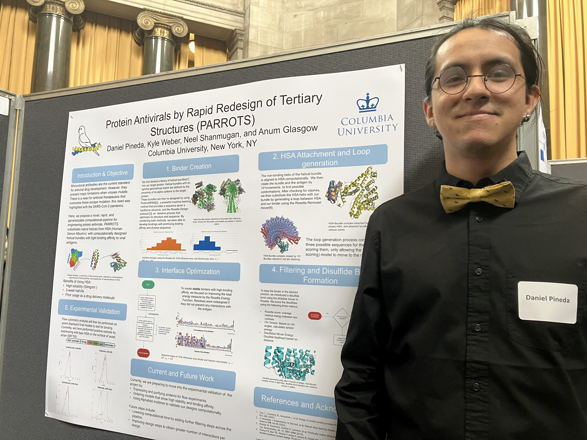

<!-- Global site tag (gtag.js) - Google Analytics -->
<script async src="https://www.googletagmanager.com/gtag/js?id=G-YXZFB7HB4L"></script>
<script>
  window.dataLayer = window.dataLayer || [];
  function gtag(){dataLayer.push(arguments);}
  gtag('js', new Date());

  gtag('config', 'G-YXZFB7HB4L');
</script>

# News

**9/4/2024** A new academic year begins after a super-fast summer.

Many updates from the last year:
- **New lab members.** Daniel Sultanov joined the lab as a postdoc last Fall after finishing his Ph.D. at NYU. Chloe Allan from Barnard joined us in the Spring and spent the summer here as an [SRI student](https://barnard.edu/summer-research-institute). Steven Rimmasch arrived in the summer from Utah as an [NSF-Rosetta Commons RaMP postbac](https://new.nsf.gov/funding/opportunities/research-mentoring-postbaccalaureates-biological). We are lucky to have you guys!

- **Preprints and publications.** Some of our recent work that we hope you find interesting, useful and fun:
  - Our [MAGPIE](https://onlinelibrary.wiley.com/doi/10.1002/pro.5027) method was published in _Protein Science_! Use it to visualize and analyze protein-ligand interactions _en masse_. Congrats to authors Daniel, Kyle, and Belen.
  - Our [PIGEON-FEATHER](https://www.biorxiv.org/content/10.1101/2024.08.04.606547v1.full) method is available on _bioRxiv_! Have you ever wondered how every single amino acid in your protein contributes energetically to its conformational ensemble, and how that changes due to ligand binding or mutations? We have you covered. Congrats to authors Chenlin, Malcolm, and Andrew.
  - We also contributed to this [perspective](https://www.cell.com/cell-systems/fulltext/S2405-4712(23)00212-0) in _Cell Systems_ about how machine learning in protein modeling and design can be useful for biological discovery.

- **Fellowships.** Our students knocked it out of the park this year.
  - Savannah and Kyle won NSF Graduate Research Fellowships! 
  - Belen earned an NIH NIAID F31!


- **Student achievements.** Kyle and Savannah passed their quals with flying colors, and Erin graduated with her BS in Biology, with department honors! We are so pleased that she's sticking around for another year as a postbac together with Steven, after teaching the Rosetta interns bootcamp (twice).


- **Presentations.** Chenlin, Andrew, Savannah, Chloe, Erin, Emily, and Daniel traveled near and far to present posters! Belen, Airam, Malcolm, and Chenlin gave talks on their work. They won a lot of prizes, including a really big check...

```{toggle}





```

- **Intra-lab education.** Chenlin, Erin, and Steven taught our annual summer computational workshop, with a focus this year on MD simulations and PyRosetta. It was amazing. Belen and Kyle got creative in a protein folding design challenge in our Molecular Biophysics course.
<br><br>


<br><br>

- **Gardening.** Our bench garden is out of control. Can you spot the giant okras?

August              |  September
:-------------------------:|:-------------------------:
  |  


We are definitely in log phase, watch this space for more cool science this year!!

```{toggle}






```

---
**7/2/2023** It's summer!

We have a lot to celebrate:
- We got some of our work out there.
  - [A large collaborative paper](https://www.sciencedirect.com/science/article/pii/S0969212623000308?via%3Dihub) that describes our computational pipeline to get more information from cryo-EM structures of complexes, and which shows how our designed ACE2 traps neutralize new strains of SARS-CoV-2. (So crazy to see our strategy for developing mutation-resistant viral therapeutics tested in a real life pandemic.)
  - [Our paper](https://www.nature.com/articles/s41467-023-36798-1) diving into the allosteric mechanism of the _lac_ repressor.
  - [A preprint](https://www.biorxiv.org/content/10.1101/2023.06.07.544141v1) in collaboration with our neighbors in the Steckelberg lab, which is about the evolution of viral protein inhibition of the human ribosome.
- At the end of the summer, Daniel will join the Biophysics graduate program at UC Berkeley! Congratulations to our first graduate. :') They will do great in California.
- Columbia undergraduates Emily and Pranav joined the lab, and they both also secured outside summer funding to support their research. Nice! Thanks very much, I. I. Rabi Scholars Program and Donald Margolis Internship Fund.
- After a productive rotation, Savannah McBride officially joined the lab fom the CUMC Genetics and Development graduate program. Welcome!
- Melody and Airam join us for the summer from the Amgen program and the Rosetta Commons REU program, respectively. Welcome!
- Belen and Andrew were the first students from our lab to pass their qualifying exams! Great job. See their [cool](people/other_photos/20230616_web_update/belen_quals.png) [posters](people/other_photos/20230616_web_update/andrew_quals.jpg) (courtesy of Chenlin and Savannah).

```{toggle}




Emily made this amazing cake that looks like Andrew's face.
```
- We finally have functional, networked servers.
<br><br>


<br><br>
- Daniel presented their work at the SURF poster session, Kyle gave a talk in the BMB seminar series, and Chenlin gave a talk at the Columbia Biochem/Biophysics Mixer.
<br><br>


<br><br>
- Andrew was Honorably Mentioned for his NSF GRFP application. Nice!
- Belen organized two lessons at Hamilton Grange Middle School in Washington Heights to engage in some fun science with our young neighbors.

```{toggle}


```

- Daniel and Kyle started the summer off by organizing a useful intra-lab computational workshop.
<br><br>

<br><br>
We are working hard this summer to move our projects along!
<br><br>

<br><br>
---


**10/15/2022** We’ve had a good summer and fall.

Some updates:
-	Belen and Andrew officially joined the lab, and Kyle is officially a graduate student!
-	Neel joined us as a  Rosetta intern over the summer, and then lucky for us, he continues here as a Columbia undergraduate!
-	Chenlin joined the lab as our venerated postdoc!
-	Despite COVID hitting our group (again), Belen and Neel made it to RosettaCon 2022, where they presented cool posters.

Neel's poster              |  Belen's poster
:-------------------------:|:-------------------------:
  |  

-	We are grateful for support from the JGI/DOE Community Research Program in Functional Genomics (towards computationally redesigning transcription factors for continuous microbial bioprocessing of plastics), Orange Grove Bio and Alleycorp (backing our PARROTS pipeline to build new antiviral biotherapeutics), NIH NIGMS (for our efforts to understand general principles for protein allostery), the Alice Bohmfalk Foundation (funds to buy computers), and the NSF ACCESS program (compute credits).
-	Our lab co-hosted an NSF GRFP writing workshop in September, and we put in a few of our own applications.
-	I’m proud of our lab members for working together and helping each other grow their projects.
-	Our tomato plants also grew a lot. See below.

```{image} people/other_photos/tomatoes.jpg
:alt: lab-photo
:class: bg-primary mb-1
:width: 1000px
:align: center
```

---

**5/26/22** The Glasgow Lab is HERE 😎

It's been a great first semester!

```{image} people/lab_photos/20220329_lab_photo.jpg
:alt: lab-banana
:class: bg-primary
:width: 350 px
:align: right
```
Some updates:
- our lab is a member of the [Rosetta Commons](https://www.rosettacommons.org/)
- we had some lab renovations and got equipment
- our first two rotation students, Kyle Helms and Julia Urban, joined us in January and left us in April. We miss them and their fantastic science
- our next batch of rotation students, Andrew Reckers and Belen Sundberg, joined us in April. They are really awesome
- after optimizing and troubleshooting for a couple months, Malcolm collected our first large HDX/MS datasets (shoutout to the world-class [ASRC MS facility](https://asrc.gc.cuny.edu/structbio/)!)
- Daniel got an Amgen scholarship for summer research!
- Daniel, Kyle W. and Anum completed Columbia's [Lab-to-Market bootcamp](https://www.irvinginstitute.columbia.edu/services/life-science-accelerator-lab-market-boot-camp) - here's a 1-min video about our project
<br>
<video height="350" controls src="../_static/videos/20210106_AAG_video.mp4"></video>
<br>
- Kyle W. designed and tested his first set of artificial transcription factors (and was admitted to Columbia for grad school!)
- we applied for grants
- we all gave our first group meetings
- Daniel and Kyle W. learned a lot at pyrosetta bootcamp
- we triumphed/survived some plasmid contamination issues and rampant COVID

We're excited to go hard this summer to advance our ongoing basic science, applied, and methods development research projects!

