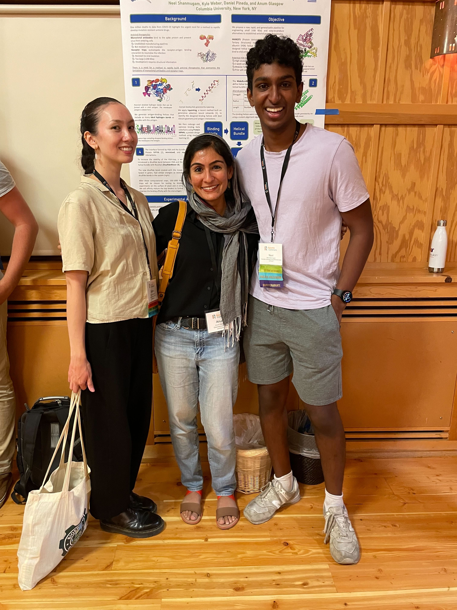

<!-- Global site tag (gtag.js) - Google Analytics -->
<script async src="https://www.googletagmanager.com/gtag/js?id=G-YXZFB7HB4L"></script>
<script>
  window.dataLayer = window.dataLayer || [];
  function gtag(){dataLayer.push(arguments);}
  gtag('js', new Date());

  gtag('config', 'G-YXZFB7HB4L');
</script>

# News

````{div} full-width

**10/15/2022** We’ve had a good summer and fall.

Some updates:
-	Belen and Andrew officially joined the lab, and Kyle is officially a graduate student!
-	Neel joined us as a  Rosetta intern over the summer, and then lucky for us, he continues here as a Columbia undergraduate!
-	Chenlin joined the lab as our venerated postdoc!
-	Despite COVID hitting our group (again), Belen and Neel made it to RosettaCon 2022, where they presented cool posters.
<p float="left">
  
   
  
</p>
-	We are grateful for support from the JGI/DOE Community Research Program in Functional Genomics (towards computationally redesigning transcription factors for continuous microbial bioprocessing of plastics), Orange Grove Bio and Alleycorp (backing our PARROTS pipeline to build new antiviral biotherapeutics), NIH NIGMS (for our efforts to understand general principles for protein allostery), the Alice Bohmfalk Foundation (funds to buy computers), and the NSF ACCESS program (compute credits).
-	Our lab co-hosted an NSF GRFP writing workshop in September, and we put in a few of our own applications.
-	I’m proud of our lab members for working together and helping each other grow their projects.
-	Our tomato plants also grew a lot. See below.

```{image} people/other_photos/tomatoes.jpg
:alt: lab-photo
:class: bg-primary mb-1
:width: 1000px
:align: center
```

---

**5/26/22** The Glasgow Lab is HERE 😎

It's been a great first semester!

```{image} people/lab_photos/20220329_lab_photo.jpg
:alt: lab-banana
:class: bg-primary
:width: 350 px
:align: right
```
Some updates:
- our lab is a member of the [Rosetta Commons](https://www.rosettacommons.org/)
- we had some lab renovations and got equipment
- our first two rotation students, Kyle Helms and Julia Urban, joined us in January and left us in April. We miss them and their fantastic science
- our next batch of rotation students, Andrew Reckers and Belen Sundberg, joined us in April. They are really awesome
- after optimizing and troubleshooting for a couple months, Malcolm collected our first large HDX/MS datasets (shoutout to the world-class [ASRC MS facility](https://asrc.gc.cuny.edu/structbio/)!)
- Daniel got an Amgen scholarship for summer research!
- Daniel, Kyle W. and Anum completed Columbia's [Lab-to-Market bootcamp](https://www.irvinginstitute.columbia.edu/services/life-science-accelerator-lab-market-boot-camp) - here's a 1-min video about our project
<br>
<video height="350" controls src="../_static/videos/20210106_AAG_video.mp4"></video>
<br>
- Kyle W. designed and tested his first set of artificial transcription factors (and was admitted to Columbia for grad school!)
- we applied for grants
- we all gave our first group meetings
- Daniel and Kyle W. learned a lot at pyrosetta bootcamp
- we triumphed/survived some plasmid contamination issues and rampant COVID

We're excited to go hard this summer to advance our ongoing basic science, applied, and methods development research projects!

```` 
