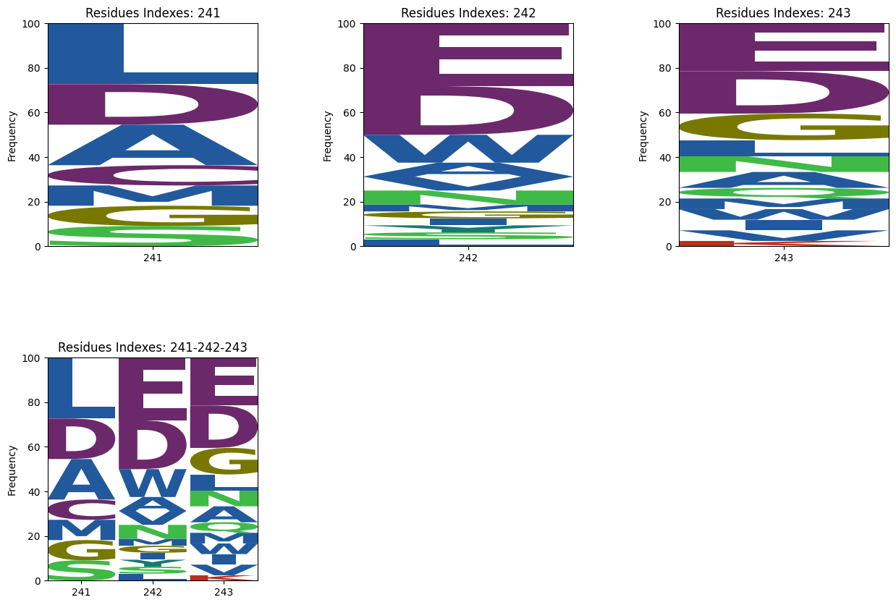

<!-- Global site tag (gtag.js) - Google Analytics -->

# Distance-based sequence logos

This online tool, hosted on Google Colab, is designed to generate sequence logos based on the distance from a target residue or ligand in a given dataset of pdbs. The distance is calculated using the alpha carbon positions between protein interfaces or all non-hydrogen atoms in the case of ligands. The tool also includes a 3D visualizer that plots the entire target structure and highlights the residues within the specified distance constraint. There are two options for coloring the interacting residues based on [Amino colour](http://acces.ens-lyon.fr/biotic/rastop/help/colour.htm#aminocolours) and [Shapely colour](http://acces.ens-lyon.fr/biotic/rastop/help/colour.htm#shapelycolours). 

The sequence logos aim to show sequence diversity in binding interactions with various motifs or structures.
This tool is able to generate sequence logos  and 3d scatter plots from a protein (Figures 1, 3) or a ligand (Figures 2, 4) target. 

    
| Figure 1 | Figure 2 |
| --- | --- |
|  |  |

| Figure 3 | Figure 4 |
| --- | --- |
|  |  |

Click [here](https://colab.research.google.com/github/glasgowlab/MAGPIE/blob/GoogleColab/MAGPIE_COLAB.ipynb) to use the interactive Google Colab tool. 

***Credits***: 

Daniel:
- [Twitter while still relevant](https://twitter.com/Dan520P)
- [Github](https://github.com/DanielP520)
- Discord: theckyy

Kyle:
- [Github](https://github.com/kweber1)
- Discord: kyleweber

